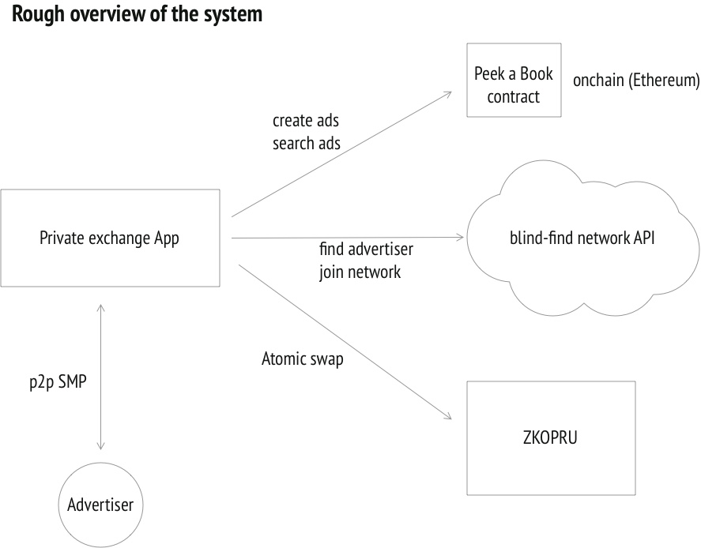
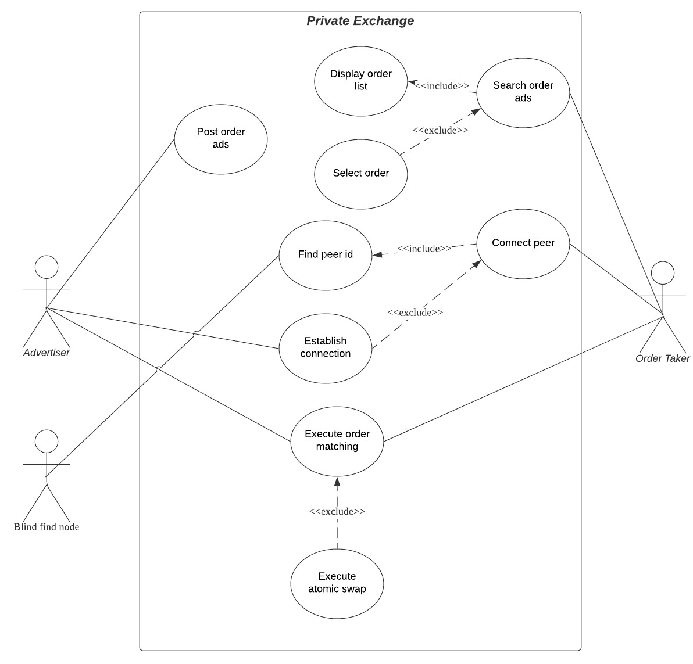

# Architecture

This document provides a architectural overview of **Private Exchange**. Explaining technology stack, usecases and system architecture.

## System architecture



## Technology stack

Private exchange consists of 4 main funtionalities. Order advertisement, private matching, peer finding and atomic swap. We use Peek a book, blind-find, SMP and ZKOPRU for each functionalities.

### Peek a book: Order advertisement and private order matching

We use peek a book protocol for order advertisement and private order matching.
Peek a book contract let order advertiser to post advertisement of exchange order with order pair and amount indicating which pair and how much amount the advertiser want to exchange. Advertisement consists of following fields `pair`, `sell_or_buy`, `amount` and `identity`.
Order take who wants to exchange the advertised pair can connect to the advertiser using `identity`. If connected, two parties execute private order matching protocol using SMP. In this protocol, the two parties only understand if their desired pair price matches or not. They won't learn any more than this fact. If the desired price matches, they proceed to atomic swap.

More info and implementation of peek-a-book and SMP can found here.

- [peek-a-book](https://github.com/mhchia/peek-a-book)
- [js-smp](https://github.com/mhchia/js-smp-peer)

### Blind-find: Peer finding

We use blind-find for private peer finding.

Order takers can search and connect to advertisers using blind-find network without revealing who they are searching for and finding out who has them as a peer. And the parties who were queried do not find out if the search was result was positive or negative and where the request came from, only that it came from one of their peers or was forwarded from one of their peers.

Detailed specs and implementation can be found here.
[blind-find](https://ethresear.ch/t/blind-find-private-social-network-search/6988)
[implementation](https://github.com/mhchia/blind-find/)

### ZKOPRU: Atomic swap

By utilizing zkopru atomic swap, two parties can swap their assets without revealing the content of the swap to anybody including zkopru coordinators.

Detailed explanation can be found here.
[zkopru atomic swap](https://docs.zkopru.network/how-it-works/atomic-swap)

### Frontend stack

- React
- Typescript
- styled-components
- ethers.js

## Use Cases diagram

Use cases of Private exchange system includes.

- Post order ads
- Search order ads
- Find/Connect peer
- Execute private order matching
- Execute atomic swap
- View History

Through these use cases, users can exchange their assets without revealing any information to others.



### Post order ads

Everything starts from posting orders. Anyone who wants to exchange any pair can post advertisement to peek-a-book contract if the pair doesn't exist on the order book yet. Advertisement data structure includes `pair`, `sell_or_buy`, `amount` and `identity` fields. Peek-a-book contract stores list of all the advertisements posted, and users can lookup the posted ads.

```
type Advertisement {
	identity
	pair
	sell_or_buy
	amount
}
```

### Search order ads

Order taker search order ads posted on peek-a-book contract. Private exchange app list all the ads on UI and users can filter and sort the ads list by `pair`, `sell_or_buy` and `amount`. User will get the information to connect to the advertiser via blind-find network e.g. peer_id, IP address.
Notice that users cannot search advertisement with pair price. Pair price matching will be executed after connecting to the advertiser using blind-find.

### Find/Connect peer

Order taker initiates peer finding to connect to advertiser after searching ads. Before initiating peer finding, users have to join blind-find network by requesting to blind-find hub (as of blind-find v1.5. This process can be done permissionlessly in the near future). User can search advertiser peer by asking the blind-find hub using the information they got in search order ads phase. If they successfully finds the peer, they can immediately establish connection with the advertiser in p2p manner. While these process, no other parties than the order taker and advertiser learn anything.

### Execute private order matching

After p2p connection is successfully established, private order matching protocol is executed. Socialist Millionair Protocol (SMP) is used as the private order matching protocol. Using this protocol, two parties test if the price of the pair both are expecting matches or not. They will never learn anything more than the fact that the price matches or not including the expecting price of the counterparty. If the price does not match, two parties disconnect the p2p connection and finish the protocol. If the price matches, they proceed to atomic swap phase. Note that the protocol succeed only when excat price matches. Since this limitation is unpleasant in terms of UX, to remove this limitation is highly prioritized in the future development.

### Execute atomic swap

When the order matching succeeded, two parties have to execute atomic swap with the matched price. Exchange amount is smaller amount of the two. Before executing atomic swap on zkopru, the two parties have to have their exchanging assets in zkopru by depositing them from L1 or received from others directly in L2. Then the two parties submit atomic swap tx to zkopru coordinator. Anyone including zkopru coordinator will not know the content of the swap thanks to zkopru.

### View History

Users can view their exchange history in the history page.

## Future work

- Blind-find update eliminating hubs
- Better price matching
